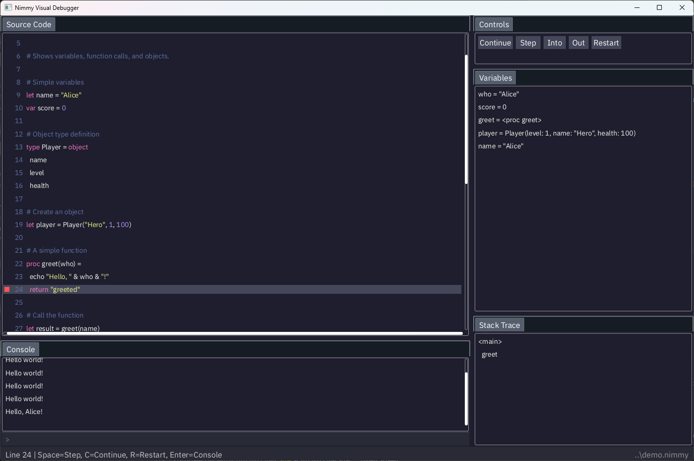

# Nimmy

`WARNING`: This is an Experimental in **vibecoding** not a quality product. This was mostly generated by AI. My aim is to generate conversatin around **vibecoding** and point people to this project.

Nimmy is a small scripting language inspired by Nim and Lua with a visual debugger.



## Overview

Nimmy is designed to be a lightweight config and scripting language for games and other applications. It combines:

- **Nim-like syntax** — Clean, readable, indentation-based syntax
- **Lua-like simplicity** — A small, simple core that's easy to understand and embed
- **Visual debugger** — A visual debugger that allows you to step through the code and see the state of the variables

The entire implementation is just a couple of files, making it easy to integrate into your projects.

## Features

- **Sandboxed execution** — Safe to run untrusted scripts
- **Embeddable** — Designed to be embedded in host applications
- **Minimal footprint** — Small codebase, easy to audit and maintain
- **Familiar syntax** — If you know Nim or Python, you'll feel at home
- **Debugging** — A debugging API that to set breakpoints and step through the code
- **Interactive mode** — An interactive mode that allows you to evaluate code and see the results

## Syntax Example

Basically Nim with most of the features stripped out. It has Lua or JavaScript feel to it.

```nim
# Variables
let name = "Nimmy"
var count = 0

# Functions
proc greet(who) =
  echo "Hello, " & who & "!"

# Control flow
if count == 0:
  greet(name)
else:
  echo "Already greeted"

# Loops
for i in 0 ..< 5:
  count = count + 1

# Types
type Person = object
  name
  age

let person = Person(name: "John", age: 30)
```

## Use Cases

- **Game scripting** — Let players or modders extend your game. If a MOD or a player script has an error you can popup the visual debugger to see the state of the variables and the stack trace, allowing the modder who might not be a programmer to figure out the issue and fix it.
- **Configuration files** — More powerful than JSON/YAML, safer than full languages. You can use Nimmy to write configuration files for your game or application. You can define functions and for loops and other control flow statements in your config file.
- **Plugin systems** — Allow third-party extensions in a sandboxed environment. Nimmy does not have a way to read or write files, run external processes, or access the internet. Unless you open up holes in the sandbox yourself.

## Embedding

Nimmy is designed to be embedded in host applications written in Nim or other languages via FFI.

```nim
import nimmy

let vm = newNimmyVM()
vm.run("""
  let x = 10
  echo x * 2
""")

vm.addProc "add", proc(a, b) =
  return a + b

vm.eval "echo add(1, 2)"
# Output: 3
```

## Debugger and inspection support

You can add breakpoints and execute the script step by step. You can also ask the VM to print the local variables, nested structures, and the stack traces.

## Design

There are only a few files:
- src/nimmy.nim
- src/nimmy/vm.nim
- src/nimmy/parser.nim
- src/nimmy/lexer.nim
- src/nimmy/types.nim
- src/nimmy/utils.nim
- src/nimmy/debug.nim

The main file is src/nimmy.nim. It contains the main entry point and the API for the VM.

## Testing

Nimmy uses "gold master" testing. There are scripts to run and their output is compared to the expected output.

## Status

Nimmy is currently in early development.

## License

MIT
