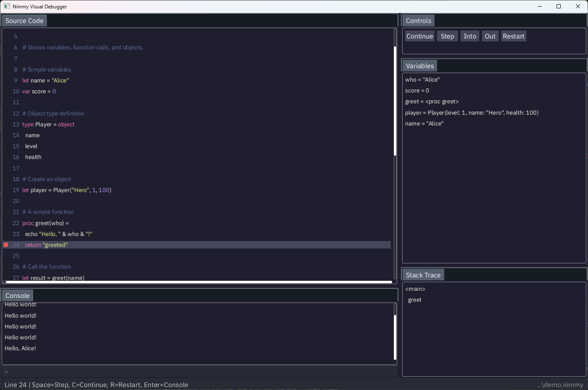

# Nimmy

`WARNING`: This is an experiment in **vibecoding**, not a quality product. This was mostly generated by AI. My aim is to generate conversation around **vibecoding** and point people to this project.

Nimmy is a small scripting language inspired by Nim and Lua with a visual debugger.



## Overview

Nimmy is designed to be a lightweight config and scripting language for games and other applications. It combines:

- **Nim-like syntax** — Clean, readable, indentation-based syntax
- **Lua-like simplicity** — A small, simple core that's easy to understand and embed
- **Visual debugger** — A visual debugger that allows you to step through the code and see the state of the variables

The entire implementation is just a couple of files, making it easy to integrate into your projects.

## Features

- **Sandboxed execution** — No file, process, or network access, and every
  element access is bounds- and type-checked so a script cannot corrupt the
  host's memory. See [Security model](#security-model) for how to run untrusted
  scripts safely.
- **Deterministic** — Tables and object fields keep insertion order, so iteration is reproducible across runs and platforms

## Fully deterministic builds

Nimmy has no random number generation built in, and tables keep insertion order. For lockstep simulations that must stay bit identical across platforms, compile the host with `-d:nimmyNoFloats`. That build:

- Rejects float literals at lex time.
- Rejects float division `/`. Use `div` for integer division.
- Does not register the float math builtins (`sin`, `sqrt`, `pow`, `float()` and friends).

The integer helpers `isqrt(x)`, `div` and the `%` modulo operator are always available, so scripts can still do distance math. Scripts that want randomness can implement their own seeded pseudo random generator in script code.
- **Embeddable** — Designed to be embedded in host applications
- **Minimal footprint** — Small codebase, easy to audit and maintain
- **Familiar syntax** — If you know Nim or Python, you'll feel at home
- **Debugging** — A debugging API to set breakpoints and step through the code
- **Interactive mode** — An interactive mode that allows you to evaluate code and see the results

## Syntax Example

Basically Nim with most of the features stripped out. It has Lua or JavaScript feel to it.

```nim
# Variables
let name = "Nimmy"
var count = 0

# Functions
proc greet(who) =
  echo "Hello, " & who & "!"

# Control flow
if count == 0:
  greet(name)
else:
  echo "Already greeted"

# Loops
for i in 0 ..< 5:
  count = count + 1

# Types
type Person = object
  name
  age

let person = Person(name: "John", age: 30)
```

## Use Cases

- **Game scripting** — Let players or modders extend your game. If a MOD or a player script has an error you can popup the visual debugger to see the state of the variables and the stack trace, allowing the modder who might not be a programmer to figure out the issue and fix it.
- **Configuration files** — More powerful than JSON/YAML, safer than full languages. You can use Nimmy to write configuration files for your game or application. You can define functions and for loops and other control flow statements in your config file.
- **Plugin systems** — Allow third-party extensions in a sandboxed environment. Nimmy does not have a way to read or write files, run external processes, or access the internet. Unless you open up holes in the sandbox yourself.

## Embedding

Nimmy is designed to be embedded in host applications written in Nim or other languages via FFI.

```nim
import nimmy

let nvm = newNimmyVM()

# Run a script
let output = nvm.run("""
  let x = 10
  echo x * 2
""")
# Output: 20

# Add a custom procedure
nvm.addProc("add") do (args: seq[Value]) -> Value:
  intValue(args[0].intVal + args[1].intVal)

discard nvm.run("echo add(1, 2)")
# Output: 3
```

## Security model

Nimmy is meant to run untrusted scripts. The language exposes no way to touch
the filesystem, spawn processes, or reach the network — the only capabilities a
script has are the builtins and custom procs the host registers. Beyond that,
the interpreter is written to fail safe:

- **Memory safety.** Every array/table read and write is bounds- and
  type-checked. An out-of-bounds index, a negative index, or a wrong-typed key
  raises a catchable `RuntimeError` — it can never read or write past a buffer.
- **Catchable failures.** Script errors are `RuntimeError` (a
  `CatchableError`), so a host can wrap `nvm.run(...)` in `try/except
  CatchableError` and keep running. A single bad script cannot take down the
  host process.
- **Bounded recursion.** Native recursion is capped by `vm.maxCallDepth`
  (default 256) so a runaway recursive script raises an error instead of
  overflowing the host's C stack.
- **Bounded memory.** Script allocations are metered against `vm.maxAllocations`
  so a script cannot exhaust host memory (see below).

To run genuinely hostile scripts, the host must also bound execution time and
memory, which are unlimited by default:

```nim
let nvm = newNimmyVM()
nvm.vm.maxSteps = 1_000_000        # abort after N statements (0 = unlimited)
nvm.vm.maxCallDepth = 256          # native recursion cap
nvm.vm.maxAllocations = 64_000_000 # allocation budget in units (0 = unlimited)
try:
  discard nvm.run(untrustedSource)
except CatchableError as e:
  echo "script rejected: ", e.msg
```

`maxAllocations` is a deterministic budget on the heap-backed data a script
creates (string and collection payloads, in approximate bytes). It complements
`maxSteps`: a statement count alone cannot stop super-linear growth such as
`s = s & s` in a loop, which doubles memory each statement — the allocation
budget stops it. The count is deterministic across platforms, so it does not
break lockstep builds.

> **Do not compile the host with `-d:danger` when running untrusted scripts.**
> `-d:danger` removes the runtime range/field checks the sandbox relies on.
> Use the default or `-d:release` build. For strong isolation, also run the
> host in an OS sandbox (separate process, seccomp/jail, resource limits) as
> defense in depth.

## Debugger and inspection support

You can add breakpoints and execute the script step by step. You can also ask the VM to print the local variables, nested structures, and the stack traces.

## Design

There are only a few files:
- src/nimmy.nim
- src/nimmy/vm.nim
- src/nimmy/parser.nim
- src/nimmy/lexer.nim
- src/nimmy/types.nim
- src/nimmy/utils.nim
- src/nimmy/debug.nim

The main file is src/nimmy.nim. It contains the main entry point and the API for the VM.

## Testing

Nimmy has comprehensive tests including:
- **Gold master tests** — Scripts with expected output that is compared to actual output
- **Stepping tests** — Tests for the VM's step-by-step execution
- **Debugging tests** — Tests for breakpoints, step-over, step-into, step-out
- **Interactive tests** — Tests for the interactive console/REPL mode

Run all tests with: `nim r tests/test_all.nim`

## Status

Nimmy is currently in early development.

## License

MIT
